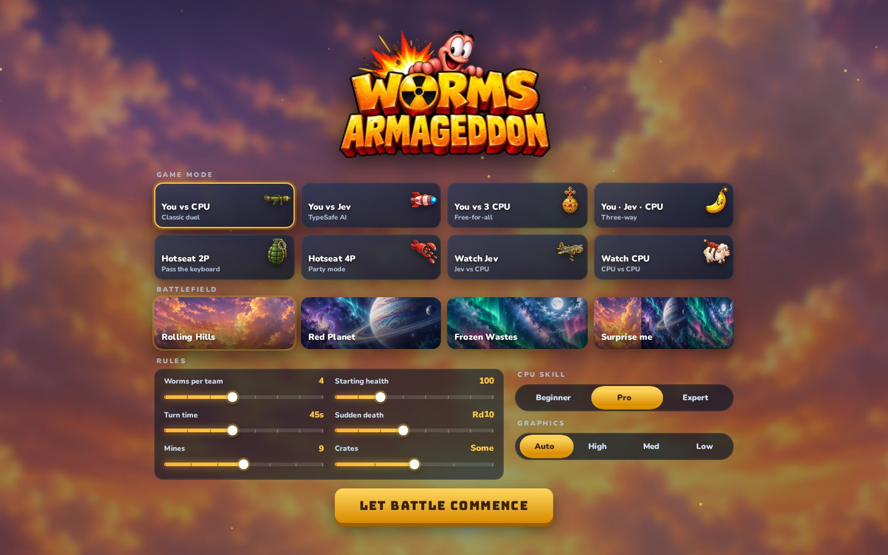
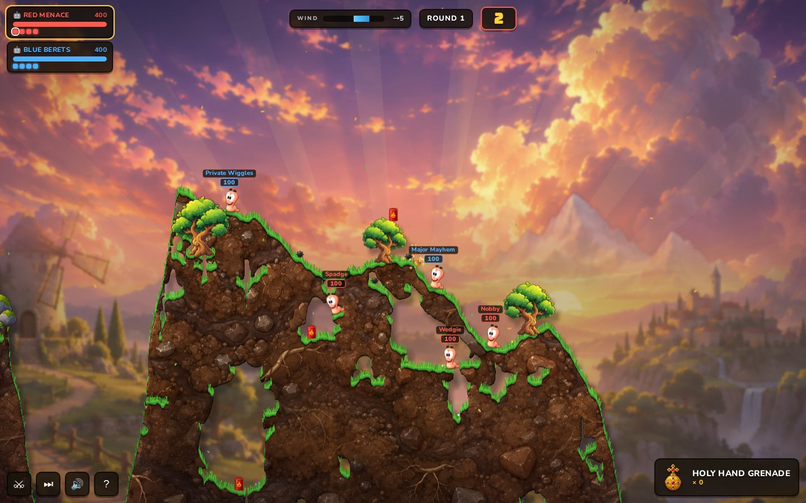
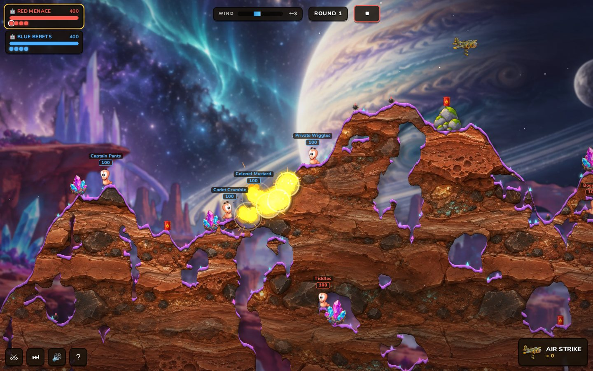
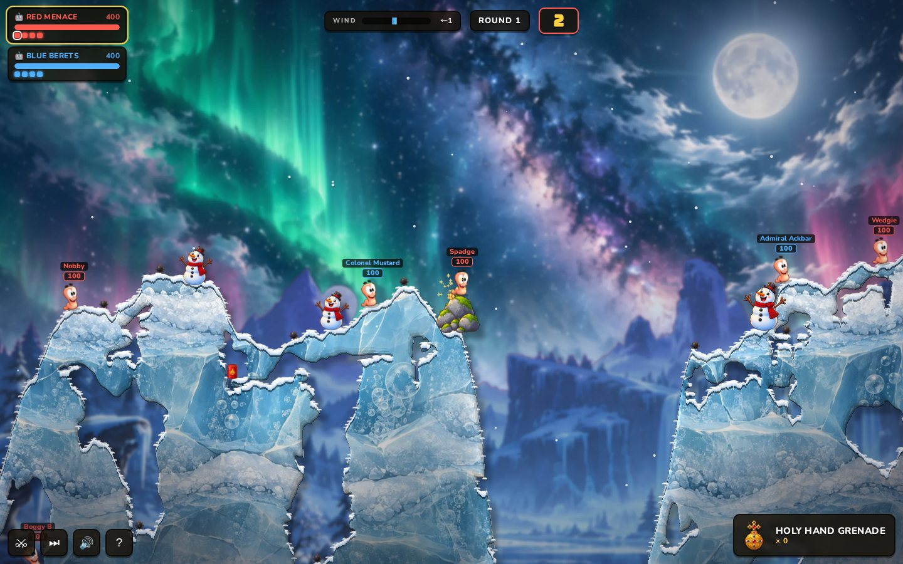
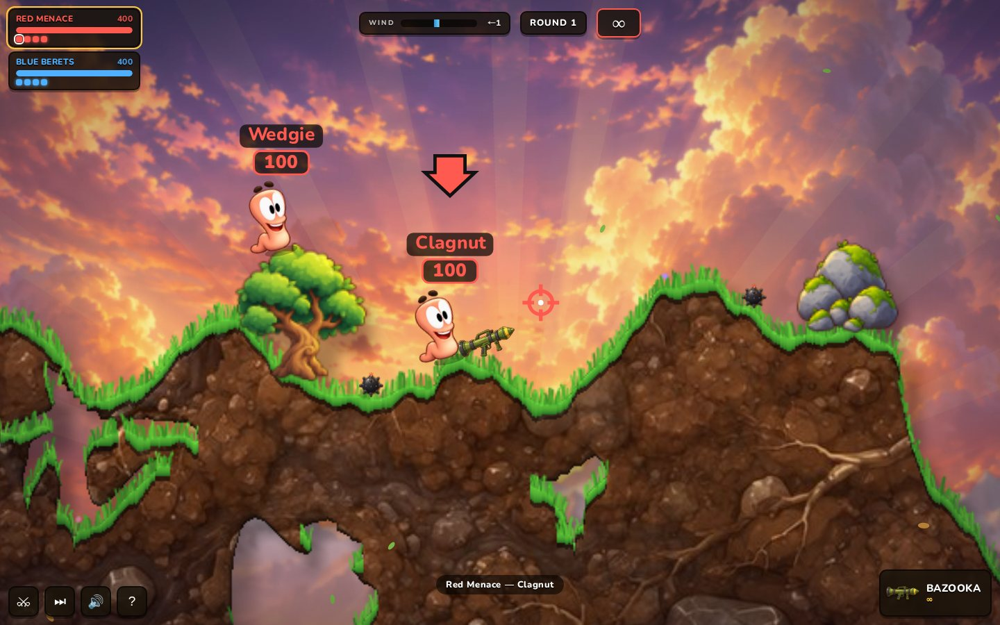
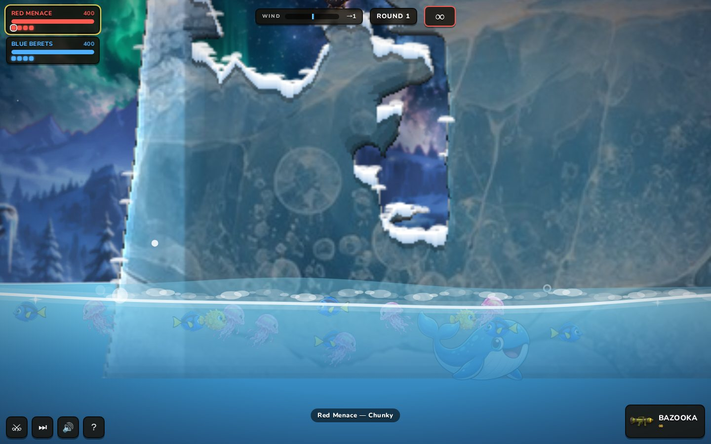

# Worms Armageddon 2026

A fan-made, browser-based tribute to Team17's 1999 classic: turn-based artillery on fully destructible terrain, playable against friends, a built-in CPU, or **Jev** (TypeSafe's decision model).

No build step: plain ES modules on a Canvas 2D renderer, served by a small Node server.



| | |
|---|---|
|  |  |
|  |  |



## Run it

```bash
npm install               # ws, for online multiplayer
node server.js            # http://localhost:8080
```

Optional environment (read from the process env or `../tools/.env`):

| Variable | Purpose |
|---|---|
| `TYPESAFE_BASE_URL` | Sprites gateway URL for TypeSafe (enables the Jev opponent, no key needed) |
| `TYPESAFE_API_KEY` | Alternative to the gateway: a raw TypeSafe key |
| `TIGRIS_ASSETS_BASE` | Sprites S3-gateway URL of the asset bucket; when set, `/assets/*` is served from Tigris with a local disk cache |
| `PORT` | Defaults to 8080 |

Without any of these the game runs fully offline from the files in `assets/`.

Add `?testmap` to the URL for the deterministic movement test course, and `?perf` (or press **F3**) for the frame-time overlay.

## What's in it

- **Destructible bitmap terrain** with procedural islands, caves and tunnels, baked lighting and drop shadows, and four themes.
- **Four worlds**: Rolling Hills, Red Planet, Frozen Wastes and Sand Dunes.
- **43 weapons and utilities**, covering most of the W:A arsenal: bazooka, homing missile, mortar, homing pigeon, grenade, cluster bomb, banana bomb, Holy Hand Grenade, petrol bomb, shotgun, handgun, Uzi, minigun, longbow, fire punch, dragon ball, kamikaze, prod, baseball bat, battle axe, dynamite, mines, Ming vase, sheep, super sheep (steerable), old woman, mad cows, air/napalm/mine/sheep strikes, earthquake, scales of justice, Concrete Donkey, Armageddon, ninja rope, jet pack, teleport, girder, blowtorch, pneumatic drill, skip go and surrender. Each weapon is held at its own size and grip.
- **Turn rules from the original**: wind, retreat time, fall damage, drowning, crates on parachutes, oil drums, sudden death with rising water.
- **Online multiplayer**: host a game, share the 6-letter code or `?join=CODE` link, and up to 4 players each take a team.
  - The host's browser runs the authoritative simulation and streams snapshots about 30 times a second.
  - Guests rebuild identical terrain from the shared seed and apply the host's crater events in order.
  - If a guest drops, the CPU takes over their team.
- **Opponents**:
  - The CPU brute-forces candidate shots with the game's own physics and then plays them with skill-based aiming error.
  - Jev picks among those simulated moves, and chooses a taunt, through the TypeSafe API.
- **Animated worms** from a 15-frame sprite atlas: idle and blink, inchworm walk, crouch, jump, fall, tumble and dizzy. The worms tilt to the slope under them, walk slower uphill, and each frame is pre-scaled to its exact device size so they stay crisp at any zoom.
- **Natural movement**:
  - Worms sit on the real ground under their footprint, fitted with outlier rejection.
  - Crawl frames lie along slopes, while standing frames only lean slightly.
  - They walk slower uphill and quicker downhill, with an inchworm speed pulse synced to the animation.
  - `?testmap` gives a measurable test course.
- **Sea life**: fish, turtles, jellyfish and a whale, per theme. They leap out of open water, spout, and scatter from explosions.
- **Layered parallax backdrops** with depth-of-field, composited by the GPU, plus an adaptive graphics tier (Auto/High/Medium/Low).
- **Title screen**: live blurred level backdrop, tilted mode and battlefield cards, Wake Slider rule bars with rolling digits, segmented pickers and a click-spark start button, all on React + shadcn/ui.
- **Audio** from ElevenLabs: 40 sound effects, three worm voice banks and an announcer.

## Layout

```
index.html, css/, js/        the game (entry: js/main.js)
server.js                    static server, WebSocket room relay, Jev proxy, Tigris-backed assets, telemetry
assets/gfx, assets/audio     game-ready art and sound
tools/                       asset pipeline
  prep_images.py             cut out and resize generated sprites
  prep_bg.py                 chroma-key parallax planes, add atmospheric depth
  slice_sheet.py             split an animation sheet into frames
  build_worm_atlas.py        pack worm frames into worm_atlas.{png,json}
  upscale.py                 Real-ESRGAN (anime model) tiled upscaler via onnxruntime
  sync_tigris.py             incremental upload of assets to the Tigris bucket
  verify_audio.py            speech-to-text check of every voice line
  walk_metrics.py            movement-quality metrics for the ?testmap course
  gen/                       the image-use and ElevenLabs generation scripts used
docs/screenshots/            README images
```

## Credits

- Art generated with [image-use](https://github.com/leeguooooo/image-use) and upscaled with Real-ESRGAN.
- Voices and sound effects by [ElevenLabs](https://elevenlabs.io).
- Opponent decisions by [TypeSafe Jev](https://typesafe.ai).
- Toasts are the [shadcn/ui Toast](https://ui.shadcn.com/docs/components/base/toast) (Base UI), with loaders from [loading.dev](https://loading.dev) (MIT).
- Menu sliders are the [React Bits Wake Slider](https://reactbits.dev/micro/wake-slider) (MIT + Commons Clause). The other title-screen effects are inspired by [React Bits](https://reactbits.dev) (Tilted Card, Click Spark, Aurora) and [Rare UI](https://rareui.com) (Animated Counter).

Worms and Worms Armageddon are trademarks of Team17. This is a non-commercial fan project and is not affiliated with Team17.
